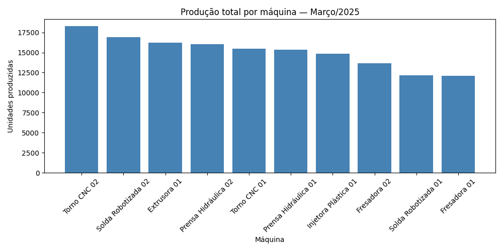
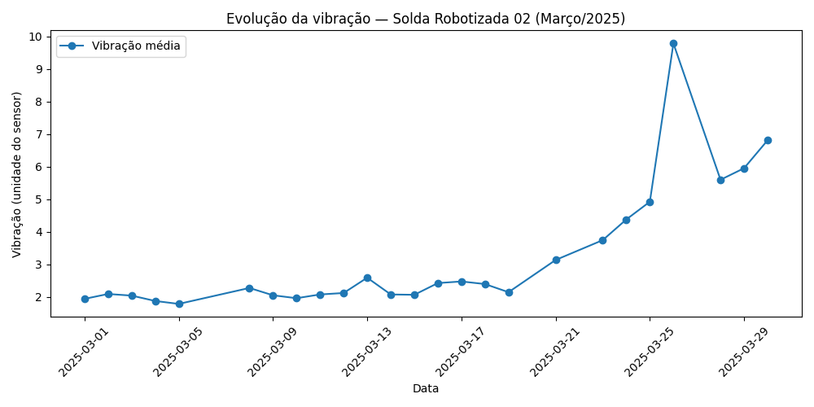
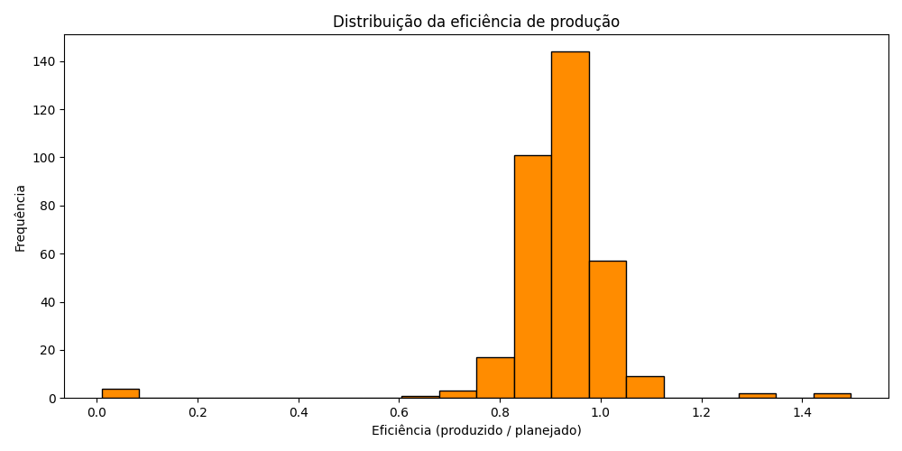
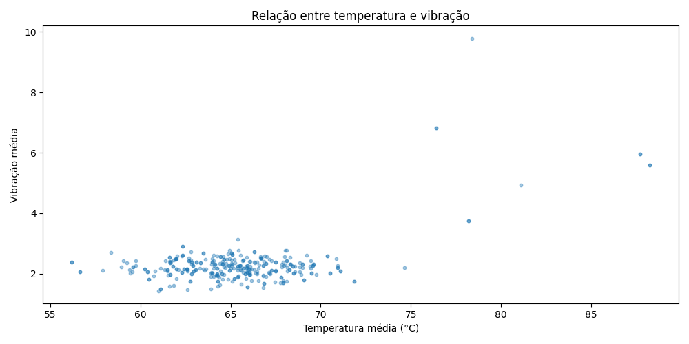
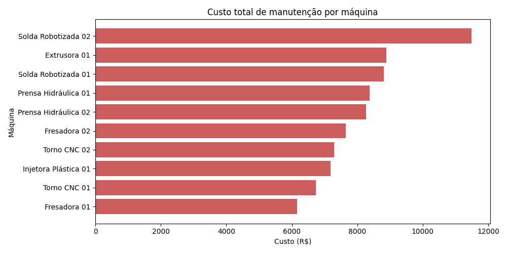

# 🏭 TECFOR Industrial — Pipeline de Análise de Dados Industriais


Pipeline completa em Python/Pandas que integra quatro fontes de dados de uma fábrica fictícia (produção, sensores, manutenção e qualidade) para diagnosticar a causa raiz de uma queda de produtividade e de um aumento nos custos de manutenção.

**Status:** `Concluído`

---

## 📑 Índice

* [Sobre o projeto](#sobre-o-projeto)
* [Funcionalidades](#funcionalidades)
* [Tecnologias utilizadas](#tecnologias-utilizadas)
* [Estrutura do projeto](#estrutura-do-projeto)
* [Como executar](#como-executar)
* [Como funciona](#como-funciona)
* [Demonstração](#demonstracao)
* [Principais decisões técnicas](#decisoes-tecnicas)
* [Testes](#testes)
* [Aprendizados](#aprendizados)
* [Autor](#autor)

---

<a id="sobre-o-projeto"></a>
## 📌 Sobre o projeto

Projeto de análise de dados industriais desenvolvido em Python com Pandas, NumPy e Matplotlib.

O cenário é a **TECFOR Industrial**, uma fábrica com 10 máquinas, 5 produtos e 3 turnos diários. Nos últimos 30 dias a diretoria percebeu queda de produtividade e aumento de custos de manutenção, mas os dados estão espalhados em quatro sistemas que não conversam entre si (produção, sensores, manutenção e qualidade). O objetivo do projeto é atuar como analista de dados: tratar, integrar e cruzar essas fontes para identificar qual máquina está por trás do problema e recomendar ações à gerência.

---

<a id="funcionalidades"></a>
## 🚀 Funcionalidades

* ✅ Leitura de 4 formatos de dados diferentes (CSV, JSON aninhado, Excel e Parquet)
* ✅ Diagnóstico automatizado de cada fonte (`shape`, `dtypes`, nulos, valores únicos, `describe()`)
* ✅ Desaninhamento de JSON com `pd.json_normalize()` (objeto `medicoes` dos sensores)
* ✅ Tratamento de nulos, duplicatas (linhas e chaves) e valores inválidos (negativos, índices acima de 100%)
* ✅ Padronização de nomes de máquinas com função própria de normalização (`padronizar_maquina`), corrigindo maiúsculas/minúsculas, espaços extras e numeração inconsistente (`"2"` → `"02"`)
* ✅ Dicionário de dados completo, coluna a coluna, com origem e tratamento aplicado
* ✅ Integração das 4 fontes via `merge()` e `groupby()/agg()`, com validação de linhas antes/depois de cada junção
* ✅ Engenharia de 10 métricas de negócio (eficiência, taxa de rejeição, custo por unidade, índice de utilização etc.) + 2 métricas próprias (`risco_termico` e `custo_total_por_peca_boa`)
* ✅ Respostas às 12 perguntas de negócio propostas, cruzando as fontes
* ✅ Investigação da causa raiz de um comportamento anormal em uma das 10 máquinas
* ✅ 5 gráficos (barras, linha, histograma, dispersão e barras horizontais) + painel com 4 KPIs, usando Matplotlib
* ✅ Exportação da base final tratada para Parquet e CSV, com comparação entre os dois formatos

---

<a id="tecnologias-utilizadas"></a>
## 🛠️ Tecnologias utilizadas

| Tecnologia | Utilização |
| --- | --- |
| Python | Linguagem principal do projeto |
| Pandas | Leitura, tratamento, integração e engenharia dos dados |
| NumPy | Operações numéricas auxiliares (ex.: substituição condicional de valores) |
| Matplotlib | Geração dos gráficos e do painel de KPIs |
| Jupyter Notebook | Ambiente de desenvolvimento (células indicam execução no Google Colab, via caminho `/content/`) |

---

<a id="estrutura-do-projeto"></a>
## 📂 Estrutura do projeto

```text
projeto/
├── DesafioFinalDupla.ipynb              # Notebook com todas as etapas da pipeline
├── producao.csv                         # Dados brutos do setor de Produção
├── sensores.json                        # Dados brutos de monitoramento de máquinas (JSON aninhado)
├── manutencao.xlsx                      # Dados brutos do setor de Manutenção
├── qualidade.parquet                    # Dados brutos do setor de Qualidade
├── Projeto_Integrador_TECFOR_Industrial.pdf  # Enunciado/especificação completa do desafio
├── base_industrial_final.parquet        # Base tratada e integrada (gerada pelo notebook)
├── base_industrial_final.csv            # Mesma base final, exportada em CSV
└── grafico_*.png                        # Gráficos gerados na Etapa 9
```

As quatro fontes brutas (`producao.csv`, `sensores.json`, `manutencao.xlsx`, `qualidade.parquet`) identificam as máquinas de formas diferentes: os sensores usam um código (`id_maquina`, ex. `MAQ-03`), enquanto produção, manutenção e qualidade usam o nome da máquina, digitado de forma inconsistente pelos operadores. O notebook resolve isso com um cadastro oficial fixo (`CODIGO_DA_MAQUINA`) e uma função de padronização de texto.

---

<a id="como-executar"></a>
## ⚙️ Como executar

**Pré-requisitos:**

```bash
pip install pandas numpy matplotlib openpyxl pyarrow
```

`openpyxl` é necessário para ler o `.xlsx` e `pyarrow` para ler/gravar o `.parquet`.

**Passos:**

1. Coloque os quatro arquivos de dados (`producao.csv`, `sensores.json`, `manutencao.xlsx`, `qualidade.parquet`) na mesma pasta usada no notebook — o código atual referencia o caminho `/content/`, próprio do Google Colab, então ajuste para o caminho local se for rodar fora do Colab (ex. `pd.read_csv("producao.csv")`).
2. Abra `DesafioFinalDupla.ipynb` em Jupyter Notebook, JupyterLab ou Google Colab.
3. Execute as células em ordem — cada etapa depende do resultado da anterior (tratamento → padronização → integração → métricas → análise → visualização → exportação).
4. Ao final, a base tratada é salva como `base_industrial_final.parquet` e `base_industrial_final.csv`, e os gráficos são salvos como arquivos `.png` na mesma pasta.

Não há variáveis de ambiente, chaves de API ou serviços externos envolvidos — o projeto roda inteiramente sobre os arquivos locais.

---

<a id="como-funciona"></a>
## 🧠 Como funciona

Fluxo geral da pipeline, implementado célula a célula no notebook:

```text
producao.csv + sensores.json + manutencao.xlsx + qualidade.parquet
        ↓
Diagnóstico individual de cada fonte (shape, dtypes, nulos, describe)
        ↓
Tratamento (nulos, duplicatas, tipos, valores inválidos, outliers)
        ↓
Padronização (nomes de máquinas, textos, datas) + dicionário de dados
        ↓
Integração (merge produção + qualidade + sensores agregados + manutenção agregada)
        ↓
Validação (linhas antes x depois, nulos introduzidos, duplicatas)
        ↓
Engenharia de métricas (eficiência, rejeição, custo, utilização, métricas próprias)
        ↓
Análise das 12 perguntas de negócio + investigação da causa raiz
        ↓
Visualização (gráficos + painel de KPIs)
        ↓
Exportação (Parquet e CSV)
```

Os sensores, que chegam com uma leitura por timestamp, são agregados por `id_maquina` e dia (`groupby(["id_maquina", "data"])`) antes de serem unidos à base de produção, assim como os eventos de manutenção são somados por máquina e dia. A base de produção (340 linhas após tratamento de duplicatas) é o eixo central: qualidade, sensores e manutenção são unidos a ela via `merge(..., how="left")`, preservando a quantidade original de registros de produção.

---

<a id="demonstracao"></a>
## 🖥️ Demonstração


*Produção total por máquina — Etapa 9 (gráfico de barras)*


*Evolução da vibração ao longo do mês — máquina identificada na investigação da Etapa 8 (gráfico de linha)*


*Distribuição da eficiência de produção (histograma)*


*Relação entre temperatura e vibração (gráfico de dispersão)*


*Custo total de manutenção por máquina*

> Painel com 4 KPIs: eficiência média, taxa média de rejeição, custo total de manutenção e tempo médio de parada.

---

<a id="decisoes-tecnicas"></a>
## 📊 Principais decisões técnicas

* **Padronização de máquinas por função dedicada**: em vez de um simples `.str.title()`, foi escrita a função `padronizar_maquina()`, que normaliza o texto (maiúsculas, espaços), corrige numeração sem zero à esquerda (`"Fresadora 2"` → `"Fresadora 02"`) e compara o resultado contra a lista oficial de 10 máquinas antes de aceitar o nome.
* **Chave entre sensores e as demais fontes**: como sensores usam `id_maquina` e as demais fontes usam o nome da máquina, foi criado um dicionário fixo (`CODIGO_DA_MAQUINA`) para mapear nome → código depois da padronização.
* **Duplicatas tratadas em dois níveis**: linhas 100% idênticas são removidas com `drop_duplicates()`; chaves duplicadas com dados diferentes (mesmo `id_producao`, por exemplo) são resolvidas mantendo um registro por critério de negócio (o mais recente em produção, o de maior quantidade inspecionada em qualidade).
* **Nulos tratados campo a campo**: mediana para variáveis numéricas (tempo de produção, quantidade produzida, custo e tempo de parada, quantidade aprovada), valor fixo `"Não informado"` para operador ausente e moda para datas ausentes.
* **Valores inválidos corrigidos, não descartados**: valores negativos (pressão, custo de manutenção, tempo de parada, quantidade produzida) foram convertidos com `.abs()`, e índices de qualidade/temperatura acima do limite fisicamente possível foram substituídos pela mediana com `.mask()`.
* **Sensores e manutenção agregados por dia antes do merge**: como há múltiplas leituras de sensor e podem existir múltiplos eventos de manutenção por máquina/dia, ambos são agregados (`mean`, `sum`, `count`, `any`) antes de serem unidos à base de produção, evitando multiplicação indevida de linhas.
* **Junções sempre à esquerda (`how="left"`) a partir da produção**: garante que a quantidade de registros de produção (340) seja preservada na base final, mesmo quando não há sensor ou inspeção de qualidade correspondente para aquele registro (o notebook identifica e reporta esses casos: 1 registro sem sensor, 110 sem inspeção de qualidade).
* **Duas métricas próprias**: `risco_termico` (desvio da temperatura do dia em relação à média histórica da própria máquina) e `custo_total_por_peca_boa` (custo de manutenção + energia do dia, dividido pelas peças aprovadas), pensadas para apontar anomalias por máquina e o custo real por peça boa entregue.

---

<a id="testes"></a>
## 🧪 Testes

Não há suíte de testes automatizados. A qualidade da integração é verificada dentro do próprio notebook por meio de:

* Comparação da quantidade de linhas antes e depois de cada `merge()`
* Contagem de valores ausentes introduzidos pela integração (sensores/qualidade sem correspondência)
* Verificação de duplicatas na base final
* `assert` de shape e de tipos de dados (`dtypes`) após salvar e reler o arquivo Parquet

---

<a id="aprendizados"></a>
## 📚 Aprendizados

* Trabalhar com um arquivo JSON de estrutura aninhada e desaninhá-lo com `pd.json_normalize()`
* Lidar com inconsistências reais entre fontes mantidas por sistemas/pessoas diferentes (grafias diferentes para a mesma máquina, chaves diferentes entre sensores e os demais setores)
* Validar cada `merge()` comparando a quantidade de linhas de entrada e saída, para identificar quando uma chave duplicada multiplica registros indevidamente
* Comparar Parquet e CSV na prática (tamanho de arquivo, preservação de tipos) após exportar a mesma base nos dois formatos — no notebook, o Parquet ficou cerca de 2x menor que o CSV equivalente
* Tomar decisões de tratamento de dados que não têm resposta única (nulos durante falhas, outliers coincidindo com eventos reais de manutenção, registros órfãos entre fontes) e justificá-las tecnicamente

---

<a id="autor"></a>
## 👨‍💻 Autor

**Lucas Braga Scudeler**
[LinkedIn](https://www.linkedin.com/in/lucas-braga-scudeler)
